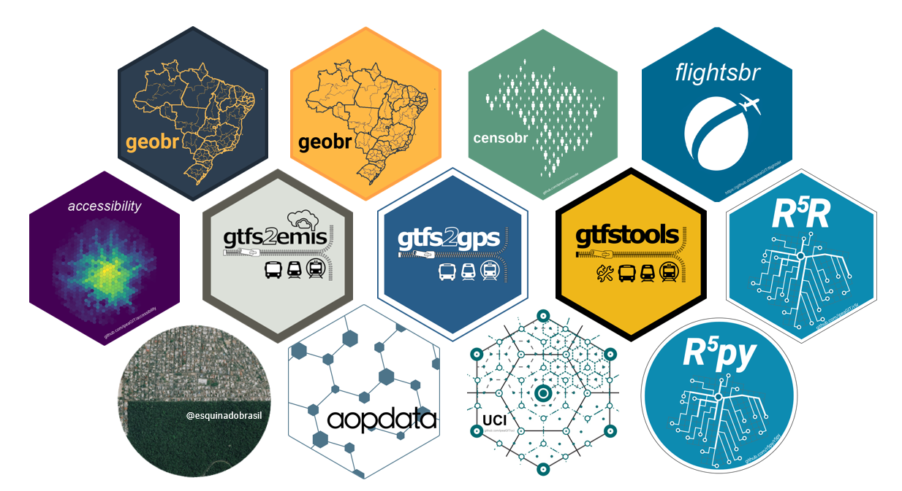

### Hi there 👋
---
My name is Rafael H. M. Pereira (Rafa for short). I work as a senior researcher and head of data science at the [Institute for Applied Economic Research (Ipea)](https://www.ipea.gov.br/portal/index.php?option=com_content&view=frontpage&Itemid=61) in Brazil.

### Research interests :satellite:
---
My research looks broadly at the intersection of urban analytics, spatial data science, mobility and urban studies. I investigate how urban and transport policies shape the spatial organization of cities, human mobility patterns as well as their impacts on social and health inequalities. I am particularly interested in the equity concerns underlying the impacts of urban and transport planning policies and their effects on inequalities in access to opportunities.

- Transport justice
- Cities and Equity
- Spatial Data Science
- Transport policies

### Packages :package:
---
A lot of the work I do involves downloading, cleaning and analyzing data. In order to make my life and the lives of others easier, I help build a few packages along the way!

**Transport and spatial modeling**
- [r5r](https://github.com/ipeaGIT/r5r): Rapid realistic routing on multimodal transport networks with R5 in R
- [r5py](https://github.com/ipeaGIT/r5r): rapid realistic routing with Python
- [accessibility](https://github.com/ipeaGIT/accessibility): Transport Accessibility Measures
- [aopdata](aopdata): Data from the Access to Opportunities Project
- [gtfstools](https://github.com/ipeaGIT/gtfstools): General Transit Feed Specification (GTFS) Editing and Analysing Tools
- [gtfs2gps](https://github.com/ipeaGIT/gtfs2gps): Converting Transport Data from GTFS Format to GPS-Like Records
- [gtfs2emis](https://github.com/ipeaGIT/gtfs2emis): Generating estimates of public transport emissions from GTFS data
- [uci](https://ipeagit.github.io/uci/): Urban Centrality Index

**Brazilian data**
- [geobr](https://github.com/ipeaGIT/geobr): Download Official Spatial Data Sets of Brazil, available in both R and Python
- [censobr](https://github.com/ipeaGIT/censobr): Download Data from Brazil’s Population Census
- [flightsbr](https://github.com/ipeaGIT/flightsbr): Download Flight And Airport Data from Brazil
- [Esquina do Brasil](https://github.com/rafapereirabr/bot_esquinadobrasil): Twitter bot posting Brazilian census tracts 🛰🌎 every 15 minutes

### Where you can find me :world_map:
---

